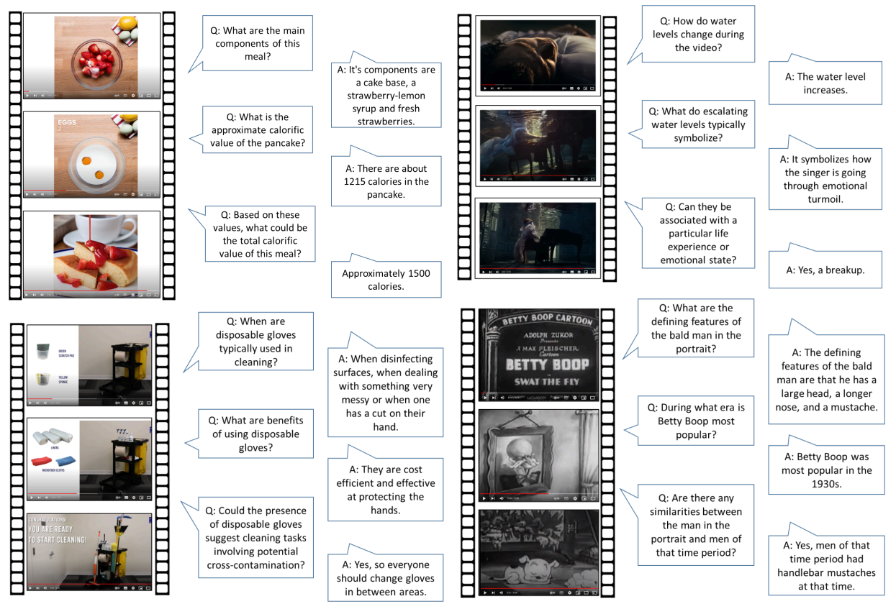

# Open Knowledge Conversational Videos \[[Paper]()]
***

# Getting Started
***
The Open Knowledge Conversational Videos Dataset is a dataset that tests a model's ability to dialogue about a video while integrating outside facts.

To Download the annotation files:
    
    git clone https://github.com/[]/OKCV.git

The dataset files are:
    
    overall_conversational_videos_dataset_final_train.json
    overall_conversational_videos_dataset_final_val.json

Our dataset uses the videos from the QuerYD dataset. They can be found here: https://www.robots.ox.ac.uk/~vgg/data/queryd/

# Reproducing Baselines
***

<table>
    <caption>Zero-shot results on the OKCV dataset</caption>
    <thead>
        <tr>
            <th>Backbone Model</th>
            <th>Knowledge</th>
            <th>Bleurt</th>
            <th>BartScore</th>
            <th>Prometheus-2</th>
        </tr>
    </thead>
    <tbody>
        <tr>
            <td>LLama2-7B</td>
            <td>Nothing</td>
            <td>0.49</td>
            <td>0.034</td>
            <td>3.58</td>
        </tr>
        <tr style="background-color: #f2f2f2;">
            <td>LLama2-7B</td>
            <td>Caption</td>
            <td>0.47</td>
            <td>0.033</td>
            <td>3.37</td>
        </tr>
        <tr>
            <td>LLama2-7B</td>
            <td>Caption+Knowledge</td>
            <td><strong>0.58</strong></td>
            <td><strong>0.117</strong></td>
            <td>2.27</td>
        </tr>
        <tr style="background-color: #f2f2f2;">
            <td>LLama3-8B</td>
            <td>Nothing</td>
            <td>0.52</td>
            <td>0.035</td>
            <td>3.10</td>
        </tr>
        <tr>
            <td>LLama3-8B</td>
            <td>Caption</td>
            <td>0.50</td>
            <td>0.034</td>
            <td>2.95</td>
        </tr>
        <tr style="background-color: #f2f2f2;">
            <td>LLama3-8B</td>
            <td>Caption+Knowledge</td>
            <td>0.49</td>
            <td>0.036</td>
            <td>2.03</td>
        </tr>
        <tr>
            <td>Mistral-7B-Instruct-v0.3</td>
            <td>Nothing</td>
            <td>0.52</td>
            <td>0.041</td>
            <td>3.66</td>
        </tr>
        <tr style="background-color: #f2f2f2;">
            <td>Mistral-7B-Instruct-v0.3</td>
            <td>Caption</td>
            <td>0.52</td>
            <td>0.040</td>
            <td>3.53</td>
        </tr>
        <tr>
            <td>Mistral-7B-Instruct-v0.3</td>
            <td>Caption+Knowledge</td>
            <td>0.51</td>
            <td>0.040</td>
            <td>3.29</td>
        </tr>
        <tr style="background-color: #f2f2f2;">
            <td>Phi-3-Small</td>
            <td>Nothing</td>
            <td>0.49</td>
            <td>0.039</td>
            <td><strong>3.74</strong></td>
        </tr>
        <tr>
            <td>Phi-3-Small</td>
            <td>Caption</td>
            <td>0.49</td>
            <td>0.039</td>
            <td>3.03</td>
        </tr>
        <tr style="background-color: #f2f2f2;">
            <td>Phi-3-Small</td>
            <td>Caption+Knowledge</td>
            <td>0.49</td>
            <td>0.040</td>
            <td>3.53</td>
        </tr>
    </tbody>
</table>

To reproduce the zero-shot results first you need to download a set of wikidata entities.
Then run the following code to embed those nodes using the CLIP4CLIP model.

    python reindexing_wikidata_ddp_videoclip.py --world_size 1 --master_addr MACHINE_IP_ADDRESS --master_port PORT --machine_index 0

Then run:

    zero_shot_experiments.py

This file can be run in multiple modes. There is a "# # [Mode Name]" line which says what mode the code will run in. Comment and uncomment the code accordingly.
The first mode you'll want to run the code in is in "Run Embedding Getting" which gets the embeddings for the videos.
Then run it in "Run retrieval" mode which will get you the retrieval set for each video.

From there each little block is a different experiment.

<table>
    <caption>Fine-tuning results of baselines on the OKCV dataset</caption>
    <thead>
        <tr>
            <th>Backbone Model</th>
            <th>Knowledge</th>
            <th>Bleurt</th>
            <th>BartScore</th>
            <th>Prometheus-2</th>
        </tr>
    </thead>
    <tbody>
        <tr>
            <td>LLama2-7B</td>
            <td>Nothing</td>
            <td>0.65</td>
            <td>0.128</td>
            <td>2.28</td>
        </tr>
        <tr style="background-color: #f2f2f2;">
            <td>LLama2-7B</td>
            <td>Captions</td>
            <td>0.66</td>
            <td>0.129</td>
            <td>2.19</td>
        </tr>
        <tr>
            <td>LLama2-7B</td>
            <td>Caption+Knowledge</td>
            <td>0.59</td>
            <td>0.047</td>
            <td>2.71</td>
        </tr>
        <tr style="background-color: #f2f2f2;">
            <td>LLama3-8B</td>
            <td>Nothing</td>
            <td>0.69</td>
            <td>0.15</td>
            <td>1.97</td>
        </tr>
        <tr>
            <td>LLama3-8B</td>
            <td>Captions</td>
            <td>0.69</td>
            <td>0.15</td>
            <td>2.03</td>
        </tr>
        <tr style="background-color: #f2f2f2;">
            <td>LLama3-8B</td>
            <td>Caption+Knowledge</td>
            <td>0.51</td>
            <td>0.15</td>
            <td>1.28</td>
        </tr>
        <tr>
            <td>Mistral-7B-Instruct-v0.3</td>
            <td>Nothing</td>
            <td>0.60</td>
            <td>0.035</td>
            <td>2.53</td>
        </tr>
        <tr style="background-color: #f2f2f2;">
            <td>Mistral-7B-Instruct-v0.3</td>
            <td>Captions</td>
            <td>0.60</td>
            <td>0.036</td>
            <td>2.55</td>
        </tr>
        <tr>
            <td>Mistral-7B-Instruct-v0.3</td>
            <td>Captions+Knowledge</td>
            <td>0.60</td>
            <td>0.036</td>
            <td>2.62</td>
        </tr>
    </tbody>
</table>

To run these experiments run:

    accelerate launch --mixed_precision fp16 llama_lora_train.py --dataset_name="HuggingFaceH4/llava-instruct-mix-vsft"     --model_name_or_path="llava-hf/llava-1.5-7b-hf"     --report_to="none"     --learning_rate=2e-5     --per_device_train_batch_size=1     --gradient_accumulation_steps=1     --output_dir="data/vsft-llava-1.5-7b-hf"     --num_train_epochs=4     --gradient_checkpointing     --remove_unused_columns=False     --torch_dtype=float16 --fp16=True  --use_peft=True     --lora_r=64     --lora_alpha=16     --lora_target_modules=all-linear --log_level="info" --logging_strategy="steps" --logging_steps=1

Most of these parameters are hard-coded in the code itself, so if you want to change them, change them there.

Then run:

     python llama_lora_eval.py

To score the models use the `bartscore_eval_results.py` and `prometheus_eval_results.py` files.

Finally the `get_scores.py` file will print out the results.

Outside Knowledge Conversational Video (OKCV) Dataset - Dialoguing over Videos
Project Page: https://anonymous.4open.science/w/OKCV-BD41/
